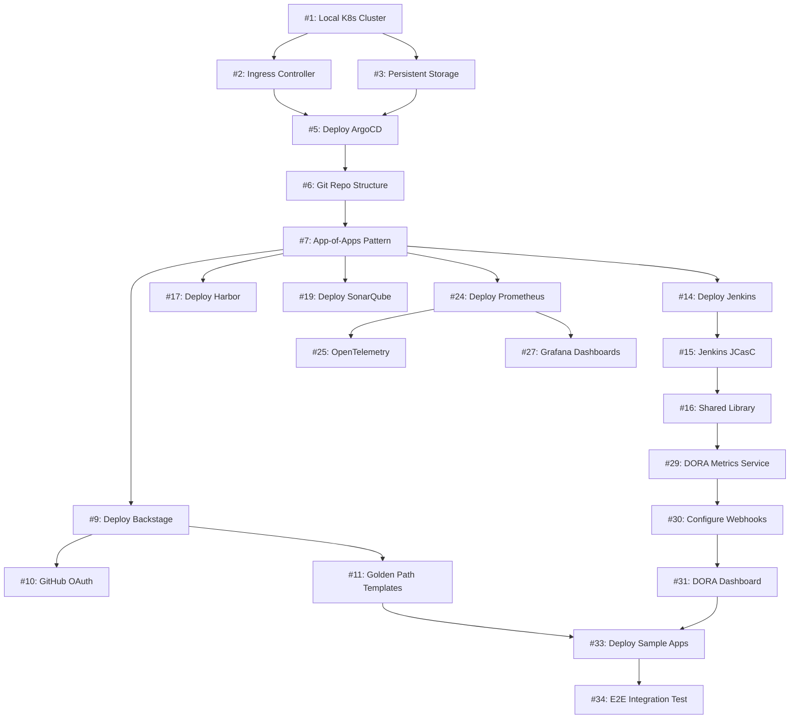
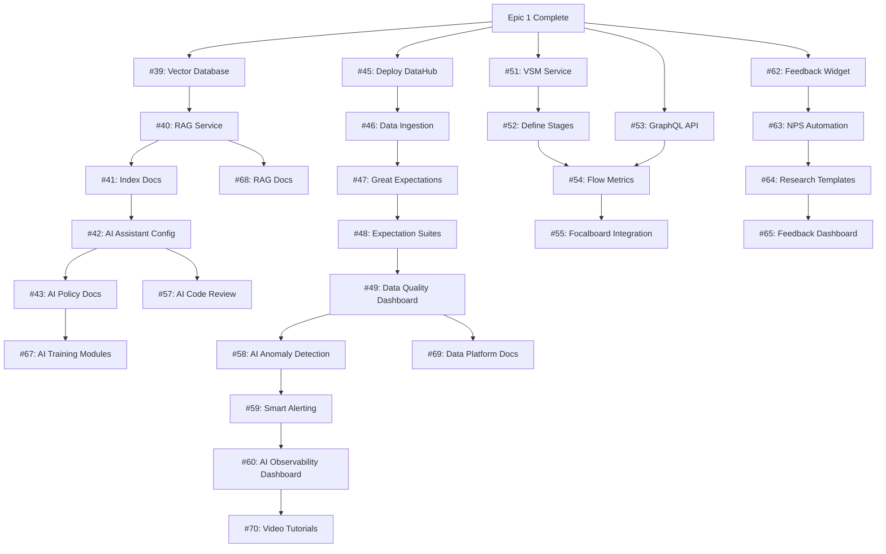
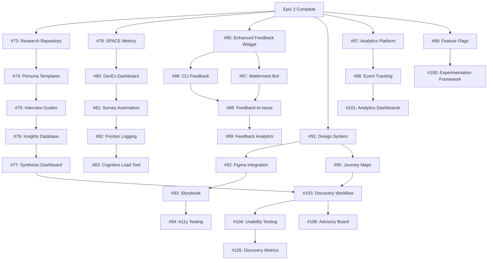

# Fawkes Implementation Plan: 3-Epic Roadmap

## Executive Summary

**Duration**: 3 months (1 epic/month)  
**Team**: You + GitHub Copilot agents (MCP-linked to GitHub + K8s)  
**Infrastructure**: Local 4-node Docker/K8s cluster (Azure fallback)  
**Approach**: Sequential epics, dogfooding from day one, CI/CD automation-friendly

-----

## Epic Structure Overview

```
Epic 1: DORA 2023 Foundation (Month 1)
├── Core platform infrastructure
├── Basic DORA metrics collection
└── Golden path templates

Epic 2: DORA 2025 AI & Data (Month 2)
├── AI integration layer
├── Healthy data ecosystems
└── VSM capabilities

Epic 3: Product Discovery & UX (Month 3)
├── User research tooling (dogfood)
├── DevEx measurement
└── Feedback-driven development
```

-----

# EPIC 1: DORA 2023 Foundation & Platform Engineering Best Practices

**Goal**: Deploy core IDP with automated DORA metrics on local 4-node K8s cluster

**Duration**: 4 weeks  
**Definition of Done**:

- ✅ All components deployed to local K8s
- ✅ Full test suite passing (unit, integration, e2e)
- ✅ Documentation complete (architecture, runbooks, troubleshooting)
- ✅ Synthetic validation (3 sample apps deployed via platform)
- ✅ Resource usage <70% on 4-node cluster
- ✅ DORA metrics automated for test apps

-----

## Epic 1 Acceptance Tests

### AT-E1-001: Local Infrastructure Deployment

```yaml
test_id: AT-E1-001
category: Infrastructure
priority: P0
description: Validate local 4-node K8s cluster is production-ready

acceptance_criteria:
  - Local K8s cluster running (Docker Desktop/kind/k3d)
  - 4 worker nodes healthy and schedulable
  - Cluster metrics available (kubelet, cAdvisor)
  - StorageClass configured for persistent volumes
  - Ingress controller deployed (nginx/traefik)
  - Cluster resource limits: CPU <70%, Memory <70%, Disk <80%

automation:
  - type: terraform_test
    location: infra/local/cluster/test/
  - type: inspec
    profile: infra/local/cluster/inspec/

validation_command: |
  kubectl get nodes --no-headers | wc -l # Must be 4
  kubectl get pods -A | grep -c Running # All core pods running
  kubectl top nodes # All nodes <70% CPU/Memory
```

-----

### AT-E1-002: GitOps with ArgoCD

```yaml
test_id: AT-E1-002
category: Continuous Delivery
priority: P0
description: ArgoCD manages all platform components declaratively

acceptance_criteria:
  - ArgoCD deployed via Helm to local cluster
  - ArgoCD CLI installed and configured
  - Git repository structure created (platform/apps/)
  - App-of-apps pattern implemented
  - All platform components synced from Git
  - Auto-sync enabled with self-heal
  - Rollback tested successfully
  - ArgoCD UI accessible via ingress

automation:
  - type: argocd_cli
    script: tests/e2e/argocd-sync-test.sh
  - type: kubernetes_manifest
    location: tests/integration/argocd/

validation_command: |
  argocd app list | grep -c Synced # All apps synced
  argocd app get platform-bootstrap --hard-refresh
  kubectl get applications -n argocd -o json | \
    jq '.items[] | select(.status.sync.status != "Synced")' | \
    jq -s 'length' # Must be 0
```

-----

### AT-E1-003: Backstage Developer Portal

```yaml
test_id: AT-E1-003
category: Developer Portal
priority: P0
description: Backstage is the single pane of glass for platform

acceptance_criteria:
  - Backstage deployed from platform/apps/backstage/
  - PostgreSQL backend deployed and initialized
  - GitHub OAuth configured (or local auth)
  - Software catalog populated with 3 templates:
    * Java Spring Boot
    * Python FastAPI
    * Node.js Express
  - TechDocs plugin enabled and rendering
  - Service catalog shows deployed apps
  - Backstage UI loads in <3 seconds
  - API responds with <500ms latency

automation:
  - type: playwright
    location: tests/e2e/backstage/
  - type: k6
    script: tests/performance/backstage-load.js

validation_command: |
  curl -f http://backstage.local/api/health
  curl -f http://backstage.local/api/catalog/entities | \
    jq '.items | length' # Must be ≥3 templates
```

-----

### AT-E1-004: CI/CD with Jenkins

```yaml
test_id: AT-E1-004
category: Continuous Integration
priority: P0
description: Jenkins pipelines build, test, scan, and deploy apps

acceptance_criteria:
  - Jenkins deployed with Kubernetes plugin
  - Jenkins Configuration as Code (JCasC) working
  - 3 golden path Jenkinsfiles in shared library:
    * Java (Maven/Gradle)
    * Python (pytest)
    * Node.js (npm)
  - Dynamic agent provisioning on K8s pods
  - Docker-in-Docker (DinD) or Kaniko working
  - SonarQube integrated for code scanning
  - Trivy integrated for container scanning
  - Pipeline success rate >95% (synthetic runs)
  - Build time P95 <10 minutes

automation:
  - type: jenkins_job_dsl
    location: platform/apps/jenkins/jobs/
  - type: groovy_unit_test
    location: tests/unit/jenkins/

validation_command: |
  curl -f http://jenkins.local/api/json
  jenkins-cli list-jobs | grep -c golden-path # Must be 3
  # Run synthetic pipeline
  jenkins-cli build golden-path-java -s -v
```

-----

### AT-E1-005: Security Scanning (DevSecOps)

```yaml
test_id: AT-E1-005
category: Security
priority: P0
description: Security is shift-left with automated scanning

acceptance_criteria:
  - SonarQube deployed and integrated with Jenkins
  - Trivy scanning all container images
  - git-secrets or TruffleHog in pipelines
  - Quality gates enforced (fail on high/critical)
  - Security scan results in Backstage
  - No critical/high vulnerabilities in platform components
  - SBOM generation for all images (Syft)
  - Security policy-as-code (OPA/Kyverno) deployed

automation:
  - type: sonarqube_api
    script: tests/integration/sonarqube-check.sh
  - type: trivy_scan
    script: tests/security/scan-all-images.sh

validation_command: |
  sonar-scanner -Dsonar.host.url=http://sonarqube.local
  trivy image --severity HIGH,CRITICAL \
    harbor.local/fawkes/sample-app:latest \
    --exit-code 1 # Must exit 0 (no vulns)
```

-----

### AT-E1-006: Observability Stack

```yaml
test_id: AT-E1-006
category: Observability
priority: P0
description: Full observability with Prometheus, Grafana, logs

acceptance_criteria:
  - Prometheus Operator (kube-prometheus-stack) deployed
  - Grafana deployed with pre-configured datasources
  - ServiceMonitors for all platform components
  - OpenTelemetry Collector deployed as DaemonSet
  - Fluent Bit collecting logs to OpenSearch
  - Grafana dashboards for:
    * Kubernetes cluster health
    * DORA metrics (4 key metrics)
    * Platform component health
    * Application metrics
  - Alerting rules configured and firing test alerts
  - Log retention policy: 30 days
  - Metrics retention: 90 days
  - Dashboard load time <2 seconds

automation:
  - type: prometheus_query
    script: tests/integration/prometheus-metrics.sh
  - type: grafana_api
    script: tests/integration/grafana-dashboards.sh

validation_command: |
  curl -f http://prometheus.local/api/v1/query?query=up
  curl -f http://grafana.local/api/health
  promtool check rules platform/apps/prometheus/rules/*.yaml
```

-----

### AT-E1-007: DORA Metrics Automation

```yaml
test_id: AT-E1-007
category: Metrics
priority: P0
description: Automated collection and visualization of 4 key DORA metrics

acceptance_criteria:
  - DORA metrics service deployed (Go/Python microservice)
  - Webhook receivers for:
    * Git commits (GitHub)
    * CI builds (Jenkins)
    * Deployments (ArgoCD)
    * Incidents (synthetic/manual)
  - All 4 metrics calculated and exposed:
    * Deployment Frequency (per day)
    * Lead Time for Changes (hours)
    * Change Failure Rate (%)
    * Time to Restore Service (hours)
  - Grafana DORA dashboard deployed
  - Historical data stored (PostgreSQL)
  - Metrics updated in real-time (<1 min lag)
  - Benchmark comparison (elite/high/medium/low)

automation:
  - type: go_test
    location: services/dora-metrics/
  - type: integration_test
    script: tests/integration/dora-webhooks.sh

validation_command: |
  curl -f http://dora-metrics.local/api/v1/metrics
  curl -s http://dora-metrics.local/api/v1/metrics | \
    jq '.deployment_frequency, .lead_time, .cfr, .mttr' | \
    grep -c null # Must be 0 (all metrics present)
```

-----

### AT-E1-008: Golden Path Templates

```yaml
test_id: AT-E1-008
category: Developer Experience
priority: P0
description: 3 golden path templates work end-to-end

acceptance_criteria:
  - Backstage templates scaffolding works:
    * Java Spring Boot + Maven
    * Python FastAPI + Poetry
    * Node.js Express + npm
  - Each template generates:
    * Dockerfile (multi-stage build)
    * Jenkinsfile (from shared library)
    * K8s manifests (Deployment, Service, Ingress)
    * ArgoCD Application manifest
    * README with quick start
  - Template validation:
    * Scaffold → Git push → Jenkins build → ArgoCD deploy
    * Full cycle completes in <15 minutes
    * App accessible via ingress
    * Health check passes
  - DORA metrics collected for template apps

automation:
  - type: backstage_scaffolder_test
    script: tests/e2e/template-scaffolding.sh
  - type: end_to_end
    script: tests/e2e/full-deployment-cycle.sh

validation_command: |
  # Scaffold all 3 templates
  for template in java-spring-boot python-fastapi nodejs-express; do
    backstage-cli app:scaffold $template --dry-run
  done
  
  # Deploy and verify
  curl -f http://sample-java-app.local/actuator/health
  curl -f http://sample-python-app.local/health
  curl -f http://sample-node-app.local/health
```

-----

### AT-E1-009: Container Registry (Harbor)

```yaml
test_id: AT-E1-009
category: Artifact Management
priority: P0
description: Harbor registry with security scanning and RBAC

acceptance_criteria:
  - Harbor deployed (Core, JobService, Registry, Trivy)
  - PostgreSQL backend for Harbor metadata
  - Redis for Harbor caching
  - Robot accounts created for CI/CD
  - Project structure:
    * fawkes/platform (platform images)
    * fawkes/apps (application images)
  - Image signing with Cosign (optional but recommended)
  - Vulnerability scanning on push
  - Replication policy for backups (optional)
  - Harbor UI accessible and functional
  - Pull/push from Jenkins working

automation:
  - type: harbor_api
    script: tests/integration/harbor-rbac.sh
  - type: docker_push_pull
    script: tests/integration/harbor-registry.sh

validation_command: |
  curl -f http://harbor.local/api/v2.0/health
  docker login harbor.local -u robot$ci -p $HARBOR_TOKEN
  docker pull harbor.local/fawkes/platform/jenkins-agent:latest
```

-----

### AT-E1-010: Resource Optimization

```yaml
test_id: AT-E1-010
category: Performance
priority: P0
description: Platform runs efficiently on 4-node cluster

acceptance_criteria:
  - Total cluster utilization:
    * CPU: <70% average
    * Memory: <70% average
    * Disk: <80% total
  - Individual component resource limits set
  - Horizontal Pod Autoscaling (HPA) configured where needed
  - Resource quotas per namespace
  - No pod evictions in last 24 hours
  - No OOMKilled containers
  - Network bandwidth <50% of capacity
  - Storage I/O <70% of capacity

automation:
  - type: kubernetes_metrics
    script: tests/performance/resource-monitoring.sh
  - type: prometheus_query
    queries: tests/performance/resource-queries.promql

validation_command: |
  kubectl top nodes
  kubectl top pods -A --sort-by=cpu
  kubectl get pods -A -o json | \
    jq '[.items[] | select(.status.phase != "Running")] | length'
```

-----

### AT-E1-011: Documentation & Runbooks

```yaml
test_id: AT-E1-011
category: Documentation
priority: P0
description: Complete documentation for Epic 1 deliverables

acceptance_criteria:
  - Architecture diagrams updated (C4 model)
  - Runbooks for all platform components:
    * Deployment procedures
    * Troubleshooting guides
    * Disaster recovery procedures
    * Backup/restore procedures
  - API documentation (Backstage TechDocs)
  - Video walkthrough (<30 min total)
  - Troubleshooting guide (top 10 issues)
  - Cost estimation documentation
  - Security hardening guide
  - All docs in Markdown, committed to Git
  - Docs pass linting (markdownlint)

automation:
  - type: markdown_lint
    script: tests/docs/lint-docs.sh
  - type: link_checker
    script: tests/docs/check-links.sh

validation_command: |
  markdownlint docs/**/*.md
  markdown-link-check docs/**/*.md
  # Verify doc structure
  test -f docs/runbooks/argocd.md
  test -f docs/runbooks/jenkins.md
  test -f docs/runbooks/backstage.md
```

-----

### AT-E1-012: End-to-End Integration

```yaml
test_id: AT-E1-012
category: Integration
priority: P0
description: Complete platform workflow validated end-to-end

acceptance_criteria:
  - Synthetic user scenario:
    1. Developer scaffolds app via Backstage
    2. Code pushed to Git triggers Jenkins build
    3. Jenkins builds, tests, scans, pushes to Harbor
    4. ArgoCD detects new image and deploys
    5. App accessible via ingress
    6. DORA metrics updated
    7. Observability data flowing (metrics, logs, traces)
  - Full cycle completes in <20 minutes
  - Zero manual interventions required
  - All components health checks green
  - DORA metrics dashboard shows data
  - No errors in any component logs

automation:
  - type: end_to_end
    script: tests/e2e/full-platform-test.sh
  - type: chaos_test
    script: tests/chaos/resilience-test.sh (optional)

validation_command: |
  ./tests/e2e/full-platform-test.sh \
    --template java-spring-boot \
    --verify-metrics \
    --verify-observability \
    --cleanup
```

-----

## Epic 1: GitHub Projects Structure

### Epic 1 Milestones

```
Milestone 1.1: Local Infrastructure (Week 1)
├── Issue #1: Set up 4-node local K8s cluster
├── Issue #2: Deploy ingress controller
├── Issue #3: Configure persistent storage
└── Issue #4: AT-E1-001 validation

Milestone 1.2: GitOps Foundation (Week 1)
├── Issue #5: Deploy ArgoCD via Helm
├── Issue #6: Create Git repo structure
├── Issue #7: Implement app-of-apps pattern
└── Issue #8: AT-E1-002 validation

Milestone 1.3: Developer Portal (Week 2)
├── Issue #9: Deploy Backstage + PostgreSQL
├── Issue #10: Configure GitHub OAuth
├── Issue #11: Create 3 golden path templates
├── Issue #12: Enable TechDocs plugin
└── Issue #13: AT-E1-003 validation

Milestone 1.4: CI/CD Pipeline (Week 2)
├── Issue #14: Deploy Jenkins with K8s plugin
├── Issue #15: Configure Jenkins JCasC
├── Issue #16: Create shared library with 3 Jenkinsfiles
├── Issue #17: Deploy Harbor container registry
└── Issue #18: AT-E1-004 + AT-E1-009 validation

Milestone 1.5: Security Scanning (Week 3)
├── Issue #19: Deploy SonarQube
├── Issue #20: Integrate Trivy scanning
├── Issue #21: Add git-secrets to pipelines
├── Issue #22: Configure security quality gates
└── Issue #23: AT-E1-005 validation

Milestone 1.6: Observability (Week 3)
├── Issue #24: Deploy kube-prometheus-stack
├── Issue #25: Deploy OpenTelemetry Collector
├── Issue #26: Deploy Fluent Bit + OpenSearch
├── Issue #27: Create Grafana dashboards
└── Issue #28: AT-E1-006 validation

Milestone 1.7: DORA Metrics (Week 4)
├── Issue #29: Implement DORA metrics service
├── Issue #30: Configure webhooks (Git, Jenkins, ArgoCD)
├── Issue #31: Create DORA Grafana dashboard
├── Issue #32: AT-E1-007 validation
└── Issue #33: Deploy 3 sample apps for testing

Milestone 1.8: Integration & Documentation (Week 4)
├── Issue #34: End-to-end integration testing
├── Issue #35: Resource optimization
├── Issue #36: Complete documentation
├── Issue #37: Create video walkthrough
└── Issue #38: AT-E1-012 final validation
```

-----

## Epic 1: Task Breakdown (Optimized for Copilot Agents)

### Example: Issue #1 - Set up 4-node local K8s cluster

```yaml
issue_number: 1
title: Set up 4-node local K8s cluster
epic: Epic 1 - DORA 2023 Foundation
milestone: 1.1 - Local Infrastructure
priority: P0
assignee: github-copilot-agent
labels: [infrastructure, kubernetes, p0, epic-1]
estimated_effort: 4 hours

description: |
  Deploy a local 4-node Kubernetes cluster using Docker Desktop, kind, or k3d.
  This is the foundation for all platform components.

acceptance_criteria:
  - 4 worker nodes running and schedulable
  - kubectl configured and working
  - Cluster metrics available
  - StorageClass configured for PVs
  - Cluster passes AT-E1-001

tasks:
  - task_id: 1.1
    description: Create Terraform module for local K8s cluster
    location: infra/local/cluster/main.tf
    copilot_prompt: |
      Create a Terraform module that:
      1. Deploys a local K8s cluster with 4 nodes (kind or k3d)
      2. Configures StorageClass for local-path-provisioner
      3. Outputs kubeconfig path
      4. Includes variables for node resources (CPU, memory)
      Use best practices for local development.
    
  - task_id: 1.2
    description: Create InSpec tests for cluster validation
    location: infra/local/cluster/inspec/controls/cluster.rb
    copilot_prompt: |
      Create InSpec tests that verify:
      1. 4 nodes exist and are Ready
      2. All system pods are Running
      3. StorageClass is available
      4. Cluster version is supported (1.28+)
      5. Resource limits are within acceptable range
    
  - task_id: 1.3
    description: Create cluster deployment script
    location: scripts/deploy-local-cluster.sh
    copilot_prompt: |
      Create a bash script that:
      1. Checks prerequisites (Docker, kind/k3d, kubectl)
      2. Runs terraform apply
      3. Configures kubectl context
      4. Waits for all nodes to be Ready
      5. Runs InSpec validation
      Includes error handling and rollback on failure.
    
  - task_id: 1.4
    description: Document cluster setup
    location: docs/runbooks/local-cluster-setup.md
    copilot_prompt: |
      Create documentation that explains:
      1. Prerequisites and system requirements
      2. Step-by-step setup instructions
      3. Troubleshooting common issues
      4. How to reset/destroy the cluster
      5. Resource requirements and tuning
      Use clear, concise language with code examples.

dependencies: []
blocks: [2, 3, 4, 5, 6, 7, 8, 9]

validation:
  - Run: terraform plan && terraform apply
  - Run: ./scripts/deploy-local-cluster.sh
  - Run: inspec exec infra/local/cluster/inspec/
  - Verify: kubectl get nodes shows 4 Ready nodes
  - Verify: AT-E1-001 acceptance test passes
```

-----

### Issue Template for Copilot Agents

```markdown
# Issue #{number}: {Title}

**Epic**: {Epic Name}  
**Milestone**: {Milestone}  
**Priority**: {P0/P1/P2}  
**Estimated Effort**: {hours}  
**Assignee**: @github-copilot-agent

## Description
{Clear description of what needs to be built}

## Acceptance Criteria
- [ ] {Criterion 1}
- [ ] {Criterion 2}
- [ ] {Criterion 3}
- [ ] Acceptance test {AT-ID} passes

## Tasks

### Task {ID}: {Task Name}
**Location**: `{file/directory}`  
**Type**: {terraform/kubernetes/go/python/markdown}

**Copilot Prompt**:
```

{Detailed prompt optimized for AI agent implementation}

```
**Validation**:
```bash
{Commands to verify task completion}
```

-----

## Dependencies

- **Depends on**: #{issue numbers}
- **Blocks**: #{issue numbers}

## Definition of Done

- [ ] Code implemented and committed
- [ ] Tests written and passing
- [ ] Documentation updated
- [ ] Code review completed (if applicable)
- [ ] Acceptance test passes
- [ ] No regressions in existing tests

## Resources

- [Architecture Doc](docs/architecture.md)
- [ADR-00X](docs/adr/ADR-00X.md)
- [Related Issue #Y](#)

```
---

## Epic 1: Dependency Graph



-----

# EPIC 2: DORA 2025 AI & Healthy Data Ecosystems

**Goal**: Integrate AI capabilities, establish data platform, implement VSM

**Duration**: 4 weeks  
**Definition of Done**:

- ✅ AI coding assistants integrated and adopted by synthetic users
- ✅ RAG system operational with internal context
- ✅ Data catalog deployed with quality monitoring
- ✅ VSM capabilities demonstrable
- ✅ Full test suite passing
- ✅ Documentation complete
- ✅ Resource usage still <70% on 4-node cluster (or documented upgrade path)

-----

## Epic 2 Acceptance Tests

### AT-E2-001: AI Coding Assistant Integration

```yaml
test_id: AT-E2-001
category: AI Integration
priority: P0
description: GitHub Copilot or alternative AI assistant is functional

acceptance_criteria:
  - AI assistant configured (GitHub Copilot or Continue.dev)
  - IDE extensions installed and tested
  - AI policy documentation published in Backstage TechDocs
  - AI tools catalog in Backstage
  - Training module "AI-Assisted Development" created
  - AI usage telemetry collected (opt-in)
  - Synthetic validation: AI generates scaffolding for new service
  - AI-generated code passes quality gates

automation:
  - type: vscode_extension_test
    script: tests/integration/ai-assistant-test.sh
  - type: synthetic_code_gen
    script: tests/integration/ai-code-generation.sh

validation_command: |
  # Verify AI policy docs exist
  curl -f http://backstage.local/docs/default/component/ai-policy
  
  # Test AI code generation
  ./tests/integration/ai-code-generation.sh \
    --prompt "Create a REST API for user management" \
    --language python \
    --verify-syntax
```

-----

### AT-E2-002: RAG Architecture

```yaml
test_id: AT-E2-002
category: AI Integration
priority: P0
description: Retrieval Augmented Generation system with internal context

acceptance_criteria:
  - Vector database deployed (Weaviate/ChromaDB/Qdrant)
  - Embedding service operational (OpenAI/local model)
  - Context sources indexed:
    * All GitHub repositories
    * Backstage TechDocs
    * Architecture documentation
    * ADRs
    * Runbooks
  - RAG service API deployed
  - Semantic search working (<500ms query time)
  - Context relevance score >0.7
  - Integration with AI assistants
  - Example queries tested and validated

automation:
  - type: vector_db_test
    script: tests/integration/vector-db-test.sh
  - type: rag_query_test
    script: tests/integration/rag-query-test.sh

validation_command: |
  curl -X POST http://rag-service.local/api/v1/query \
    -d '{"query": "How do I deploy a new service?"}' | \
    jq '.results[0].relevance_score' | \
    awk '{if ($1 > 0.7) exit 0; else exit 1}'
```

-----

### AT-E2-003: Data Catalog (DataHub)

```yaml
test_id: AT-E2-003
category: Data Platform
priority: P0
description: Data catalog with metadata and lineage

acceptance_criteria:
  - DataHub deployed (GMS, Frontend, MAE, MCE)
  - PostgreSQL backend for metadata
  - Kafka for metadata events (or lightweight alternative)
  - Data sources ingested:
    * PostgreSQL databases (Backstage, Harbor, etc.)
    * Kubernetes resources
    * Git repositories
    * CI/CD pipelines (Jenkins)
  - Metadata lineage visualized
  - Search and discovery functional
  - RBAC configured
  - DataHub UI accessible and responsive

automation:
  - type: datahub_cli
    script: tests/integration/datahub-ingestion.sh
  - type: api_test
    script: tests/integration/datahub-api-test.sh

validation_command: |
  datahub check local-system
  curl -f http://datahub.local/api/v2/graphql \
    -d '{"query": "{ search(input: {type: DATASET, query: \"*\"}) { total } }"}' | \
    jq '.data.search.total' # Must be >0
```

-----

### AT-E2-004: Data Quality Framework

```yaml
test_id: AT-E2-004
category: Data Platform
priority: P0
description: Automated data quality monitoring with Great Expectations

acceptance_criteria:
  - Great Expectations deployed
  - Data sources configured (same as DataHub)
  - Expectation suites defined:
    * Schema validation
    * Null checks
    * Uniqueness constraints
    * Range checks
    * Referential integrity
  - Automated validation on data changes
  - Data quality dashboard in Grafana
  - Alerting on quality violations
  - Data docs generated and published

automation:
  - type: great_expectations_test
    script: tests/integration/data-quality-test.sh
  - type: checkpoint_run
    script: tests/integration/gx-checkpoint.sh

validation_command: |
  great_expectations checkpoint run backstage_db_checkpoint
  great_expectations checkpoint run harbor_db_checkpoint
  # Verify all passed
  great_expectations checkpoint script backstage_db_checkpoint --json | \
    jq '.success' # Must be true
```

-----

### AT-E2-005: Value Stream Mapping

```yaml
test_id: AT-E2-005
category: VSM
priority: P0
description: Value stream visibility from idea to production

acceptance_criteria:
  - VSM tool integrated (Backstage plugin or standalone)
  - Value stream stages defined:
    * Backlog → Design → Development → Review → Test → Deploy → Operate
  - Work items tracked across stages
  - Cycle time measured per stage
  - Bottleneck detection automated
  - Flow metrics dashboard:
    * Work in Progress (WIP)
    * Throughput
    * Cycle time
    * Lead time
  - Integration with Focalboard (for work tracking)
  - Historical trending available

automation:
  - type: vsm_api_test
    script: tests/integration/vsm-metrics.sh
  - type: flow_metrics_test
    script: tests/integration/flow-metrics.sh

validation_command: |
  curl -f http://vsm-service.local/api/v1/metrics | \
    jq '.stages[] | select(.cycle_time > 0) | length' # All stages have data
```

-----

### AT-E2-006: AI Governance Framework

```yaml
test_id: AT-E2-006
category: AI Governance
priority: P0
description: Clear AI usage policy and compliance tracking

acceptance_criteria:
  - AI usage policy documented and approved
  - Approved tools list published
  - AI training modules in dojo:
    * "AI-Assisted Development Best Practices"
    * "Prompt Engineering for Developers"
    * "AI Code Review & Validation"
  - AI usage telemetry dashboard
  - Compliance checks automated
  - AI-generated code marked in PRs
  - Security review process for AI tools
  - Data privacy guidelines enforced

automation:
  - type: policy_compliance_test
    script: tests/integration/ai-policy-compliance.sh
  - type: telemetry_test
    script: tests/integration/ai-usage-metrics.sh

validation_command: |
  # Verify AI policy docs published
  curl -f http://backstage.local/docs/default/component/ai-usage-policy
  
  # Check AI training modules exist
  curl -f http://backstage.local/api/dojo/modules | \
    jq '[.[] | select(.category == "ai")] | length' # Must be ≥3
  
  # Verify AI usage telemetry
  curl -f http://grafana.local/api/dashboards/uid/ai-usage | \
    jq '.dashboard.panels | length' # Must have panels
```

-----

### AT-E2-007: AI Code Review Automation

```yaml
test_id: AT-E2-007
category: AI Integration
priority: P1
description: AI-powered code review catches issues pre-merge

acceptance_criteria:
  - AI code review bot deployed (GitHub Actions or Jenkins plugin)
  - Review categories:
    * Code quality issues
    * Security vulnerabilities
    * Performance anti-patterns
    * Best practice violations
    * Documentation gaps
  - Integration with SonarQube
  - PR comments automated
  - False positive rate <20%
  - Review time <5 minutes
  - Human review still required (AI as assistant)

automation:
  - type: pr_review_test
    script: tests/integration/ai-code-review-test.sh
  - type: false_positive_analysis
    script: tests/quality/ai-review-accuracy.sh

validation_command: |
  # Create test PR with known issues
  ./tests/integration/create-test-pr.sh --with-issues
  
  # Verify AI review comments appear
  gh pr view 9999 --json comments | \
    jq '[.comments[] | select(.author.login == "ai-reviewer-bot")] | length' # Must be >0
```

-----

### AT-E2-008: Unified Data API

```yaml
test_id: AT-E2-008
category: Data Platform
priority: P1
description: GraphQL API for self-service data access

acceptance_criteria:
  - GraphQL server deployed (Hasura or custom)
  - Schema covering all data sources:
    * DORA metrics
    * Build data (Jenkins)
    * Deployment data (ArgoCD)
    * Service catalog (Backstage)
    * Data quality metrics
    * VSM metrics
  - RBAC enforced at data level
  - Query performance <1 second (P95)
  - API documentation (GraphQL Playground)
  - Rate limiting configured
  - Caching layer (Redis)

automation:
  - type: graphql_test
    script: tests/integration/graphql-api-test.sh
  - type: performance_test
    script: tests/performance/graphql-load-test.js

validation_command: |
  curl -f http://data-api.local/graphql \
    -d '{"query": "{ doraMetrics { deploymentFrequency } }"}' | \
    jq '.data.doraMetrics.deploymentFrequency' # Must not be null
  
  # Performance test
  k6 run tests/performance/graphql-load-test.js \
    --vus 10 --duration 30s # P95 must be <1s
```

-----

### AT-E2-009: AI Observability

```yaml
test_id: AT-E2-009
category: AI Integration
priority: P1
description: AI-powered anomaly detection and alerting

acceptance_criteria:
  - AI anomaly detection deployed (Prometheus AI, Grafana ML)
  - Models trained on historical metrics
  - Anomaly detection for:
    * Deployment failures
    * Build time spikes
    * Resource usage anomalies
    * Error rate increases
  - Smart alerting (reduce noise)
  - Incident root cause suggestions
  - Self-healing capabilities (optional)
  - False alert rate <10%

automation:
  - type: anomaly_detection_test
    script: tests/integration/ai-anomaly-test.sh
  - type: alert_accuracy_test
    script: tests/quality/alert-accuracy.sh

validation_command: |
  # Inject anomaly (high error rate)
  ./tests/chaos/inject-errors.sh --rate 50%
  
  # Verify AI detects it within 5 minutes
  timeout 300 bash -c '
    until curl -s http://ai-observability.local/api/anomalies | \
      jq ".anomalies[] | select(.type == \"error_rate_spike\")" | \
      grep -q "error_rate_spike"; do
      sleep 10
    done
  '
```

-----

### AT-E2-010: Discovery Capability Foundation

```yaml
test_id: AT-E2-010
category: Product Discovery
priority: P1
description: Basic discovery tools integrated (foundation for Epic 3)

acceptance_criteria:
  - User interview template created in Focalboard
  - Feedback widget deployed in Backstage (plugin)
  - NPS survey automation configured
  - Feedback data stored in database
  - Basic analytics dashboard (Grafana)
  - User persona templates created
  - Journey mapping template created
  - Discovery workflow documented

automation:
  - type: feedback_widget_test
    script: tests/integration/feedback-widget-test.sh
  - type: nps_survey_test
    script: tests/integration/nps-automation-test.sh

validation_command: |
  # Test feedback submission
  curl -X POST http://backstage.local/api/feedback \
    -d '{"rating": 4, "comment": "Great platform!", "user": "test"}' | \
    jq '.id' # Must return ID
  
  # Verify feedback appears in dashboard
  curl -f http://grafana.local/api/dashboards/uid/feedback-analytics
```

-----

### AT-E2-011: Resource Optimization (Continued)

```yaml
test_id: AT-E2-011
category: Performance
priority: P0
description: Platform still efficient with AI/data components

acceptance_criteria:
  - Total cluster utilization:
    * CPU: <75% average (5% increase tolerance)
    * Memory: <75% average
    * Disk: <80% total
  - AI workloads scheduled efficiently
  - Vector database within resource budget
  - DataHub performance acceptable
  - Optional: Document upgrade to 6-node cluster if needed
  - Cost analysis documented
  - Resource usage dashboard updated

automation:
  - type: resource_monitoring
    script: tests/performance/resource-monitoring-epic2.sh
  - type: cost_analysis
    script: tests/analysis/cost-estimation.sh

validation_command: |
  kubectl top nodes | awk 'NR>1 {sum+=$3; count++} END {print sum/count}' | \
    awk '{if ($1 < 75) exit 0; else exit 1}' # CPU <75%
  
  # Check for resource pressure
  kubectl get nodes -o json | \
    jq '[.items[] | select(.status.conditions[] | 
      select(.type == "MemoryPressure" and .status == "True"))] | length' # Must be 0
```

-----

### AT-E2-012: Documentation & Training

```yaml
test_id: AT-E2-012
category: Documentation
priority: P0
description: Complete documentation for Epic 2 deliverables

acceptance_criteria:
  - AI integration guide complete
  - RAG architecture documented
  - Data platform runbooks created
  - VSM documentation with examples
  - AI training modules complete (3 modules)
  - Video tutorials for AI features (<15 min each)
  - Troubleshooting guide updated
  - Architecture diagrams updated
  - ADRs for all major decisions

automation:
  - type: docs_validation
    script: tests/docs/validate-epic2-docs.sh
  - type: link_checker
    script: tests/docs/check-links.sh

validation_command: |
  # Verify all required docs exist
  required_docs=(
    "docs/ai/integration-guide.md"
    "docs/ai/rag-architecture.md"
    "docs/data-platform/overview.md"
    "docs/vsm/value-stream-mapping.md"
    "docs/dojo/modules/ai-assisted-development.md"
  )
  
  for doc in "${required_docs[@]}"; do
    test -f "$doc" || exit 1
  done
```

-----

## Epic 2: GitHub Projects Structure

### Epic 2 Milestones

```
Milestone 2.1: AI Foundation (Week 1)
├── Issue #39: Deploy vector database (Weaviate/ChromaDB)
├── Issue #40: Implement RAG service
├── Issue #41: Index internal documentation
├── Issue #42: Configure AI coding assistant (Copilot/Continue.dev)
├── Issue #43: Create AI usage policy docs
└── Issue #44: AT-E2-001, AT-E2-002 validation

Milestone 2.2: Data Platform (Week 2)
├── Issue #45: Deploy DataHub (data catalog)
├── Issue #46: Configure data source ingestion
├── Issue #47: Deploy Great Expectations
├── Issue #48: Create expectation suites
├── Issue #49: Build data quality dashboard
└── Issue #50: AT-E2-003, AT-E2-004 validation

Milestone 2.3: Value Stream & APIs (Week 2-3)
├── Issue #51: Implement VSM tracking service
├── Issue #52: Define value stream stages
├── Issue #53: Deploy GraphQL unified data API
├── Issue #54: Create flow metrics dashboard
├── Issue #55: Integrate with Focalboard
└── Issue #56: AT-E2-005, AT-E2-008 validation

Milestone 2.4: AI-Enhanced Operations (Week 3)
├── Issue #57: Deploy AI code review bot
├── Issue #58: Configure AI anomaly detection
├── Issue #59: Implement smart alerting
├── Issue #60: Create AI observability dashboard
└── Issue #61: AT-E2-007, AT-E2-009 validation

Milestone 2.5: Discovery Foundation (Week 4)
├── Issue #62: Deploy feedback widget in Backstage
├── Issue #63: Configure NPS survey automation
├── Issue #64: Create user research templates
├── Issue #65: Build feedback analytics dashboard
└── Issue #66: AT-E2-010 validation

Milestone 2.6: Training & Documentation (Week 4)
├── Issue #67: Create AI training modules (3 modules)
├── Issue #68: Document RAG architecture
├── Issue #69: Create data platform runbooks
├── Issue #70: Record video tutorials
├── Issue #71: Resource optimization analysis
└── Issue #72: AT-E2-011, AT-E2-012 validation
```

-----

## Epic 2: Dependency Graph



-----

# EPIC 3: Product Discovery, Design & User-Centric Development

**Goal**: Implement comprehensive product discovery capabilities and user-centric design process (dogfooding)

**Duration**: 4 weeks  
**Definition of Done**:

- ✅ User research tooling fully operational
- ✅ DevEx measurement framework implemented (SPACE)
- ✅ Design system and prototyping tools integrated
- ✅ Continuous discovery process established
- ✅ All discovery workflows documented
- ✅ Platform team practicing continuous discovery
- ✅ Full test suite passing
- ✅ Resource usage optimized

-----

## Epic 3 Acceptance Tests

### AT-E3-001: User Research Infrastructure

```yaml
test_id: AT-E3-001
category: User Research
priority: P0
description: Complete user research tooling and workflows

acceptance_criteria:
  - User interview scheduling automation (Calendly integration or similar)
  - Interview recording and transcription (optional: local tools)
  - Research repository in Backstage
  - User persona templates (5 personas defined)
  - Interview guide templates (by research type)
  - Research insights database
  - Tagging and categorization system
  - Research synthesis dashboard
  - Monthly research review process documented

automation:
  - type: api_test
    script: tests/integration/user-research-api-test.sh
  - type: workflow_test
    script: tests/integration/research-workflow-test.sh

validation_command: |
  # Verify research repository exists
  curl -f http://backstage.local/api/catalog/entities?kind=UserResearch | \
    jq '.items | length' # Must be >0
  
  # Test interview creation
  curl -X POST http://research-api.local/api/v1/interviews \
    -d '{"participant": "test-user", "type": "discovery"}' | \
    jq '.id'
```

-----

### AT-E3-002: DevEx Measurement (SPACE Framework)

```yaml
test_id: AT-E3-002
category: Developer Experience
priority: P0
description: Comprehensive DevEx metrics using SPACE framework

acceptance_criteria:
  - SPACE dimensions implemented:
    * Satisfaction: NPS, sentiment surveys
    * Performance: Perceived productivity
    * Activity: Platform usage metrics
    * Communication: Collaboration metrics
    * Efficiency: Time-to-value, friction logs
  - Automated metric collection
  - DevEx dashboard in Grafana (5 dimensions)
  - Quarterly survey automation
  - Friction logging system
  - Cognitive load assessment tool
  - Trend analysis and insights
  - Benchmark comparisons

automation:
  - type: metrics_collection_test
    script: tests/integration/devex-metrics-test.sh
  - type: survey_automation_test
    script: tests/integration/devex-survey-test.sh

validation_command: |
  # Verify all SPACE dimensions have data
  curl -f http://devex-api.local/api/v1/metrics/space | \
    jq 'to_entries | length' # Must be 5 (all dimensions)
  
  # Check dashboard exists
  curl -f http://grafana.local/api/dashboards/uid/devex-space
```

-----

### AT-E3-003: Feedback Loop Automation

```yaml
test_id: AT-E3-003
category: Feedback Management
priority: P0
description: Comprehensive feedback collection and action system

acceptance_criteria:
  - Multiple feedback channels:
    * In-app widget (Backstage)
    * CLI tool for developers
    * Slack/Mattermost bot
    * Email submissions
  - Feedback categorization (automatic + manual)
  - Feedback prioritization scoring
  - Feedback-to-issue automation (GitHub Issues)
  - Response time tracking (<48 hours target)
  - Feedback resolution tracking
  - Sentiment analysis (optional: ML-based)
  - Monthly feedback review dashboard

automation:
  - type: feedback_submission_test
    script: tests/integration/feedback-channels-test.sh
  - type: automation_test
    script: tests/integration/feedback-to-issue-test.sh

validation_command: |
  # Test all feedback channels
  ./tests/integration/feedback-channels-test.sh \
    --test-widget \
    --test-cli \
    --test-bot
  
  # Verify feedback appears in dashboard
  curl -f http://feedback-api.local/api/v1/feedback?status=open | \
    jq '.items | length' # Must be ≥0
```

-----

### AT-E3-004: Design System Integration

```yaml
test_id: AT-E3-004
category: Design & Prototyping
priority: P1
description: Design system and prototyping tools for platform UX

acceptance_criteria:
  - Design system component library
  - Backstage theme customization
  - Figma integration (or open-source alternative: Penpot)
  - Design tokens defined (colors, typography, spacing)
  - Component documentation in Storybook
  - Accessibility guidelines (WCAG 2.1 AA)
  - Design review process documented
  - Prototype-to-code workflow

automation:
  - type: storybook_test
    script: tests/integration/storybook-build-test.sh
  - type: accessibility_test
    script: tests/quality/a11y-test.sh

validation_command: |
  # Build Storybook
  npm run build-storybook
  
  # Run accessibility tests
  npm run test:a11y -- --threshold 90 # 90% WCAG compliance
  
  # Verify design tokens
  test -f platform/design-system/tokens.json
```

-----

### AT-E3-005: Journey Mapping & Service Blueprints

```yaml
test_id: AT-E3-005
category: UX Design
priority: P1
description: User journey maps and service blueprints for key workflows

acceptance_criteria:
  - Journey mapping tool integrated (Miro/Mural alternative or custom)
  - Key journeys documented (minimum 5):
    * Onboarding new developer
    * Deploying first application
    * Troubleshooting failed deployment
    * Creating custom template
    * Contributing to platform
  - Service blueprints for each journey
  - Pain points identified and prioritized
  - Opportunity areas documented
  - Journey maps in Backstage TechDocs
  - Quarterly journey review process

automation:
  - type: journey_validation
    script: tests/integration/journey-completeness-test.sh
  - type: docs_validation
    script: tests/docs/journey-maps-exist.sh

validation_command: |
  # Verify all required journeys exist
  required_journeys=(
    "onboarding"
    "first-deployment"
    "troubleshooting"
    "custom-template"
    "contributing"
  )
  
  for journey in "${required_journeys[@]}"; do
    test -f "docs/journeys/$journey.md" || exit 1
  done
```

-----

### AT-E3-006: Experimentation Framework

```yaml
test_id: AT-E3-006
category: Product Discovery
priority: P1
description: A/B testing and feature flag infrastructure

acceptance_criteria:
  - Feature flag system deployed (Unleash or similar)
  - A/B test framework integrated
  - Experiment tracking dashboard
  - Statistical significance calculator
  - Experiment documentation template
  - Integration with analytics
  - Gradual rollout capabilities
  - Rollback automation on negative metrics

automation:
  - type: feature_flag_test
    script: tests/integration/feature-flags-test.sh
  - type: ab_test_simulation
    script: tests/integration/ab-test-simulation.sh

validation_command: |
  # Verify feature flag service
  curl -f http://feature-flags.local/api/health
  
  # Test flag toggle
  curl -X POST http://feature-flags.local/api/v1/flags \
    -d '{"name": "test-feature", "enabled": true}' | \
    jq '.enabled' # Must be true
```

-----

### AT-E3-007: Product Analytics

```yaml
test_id: AT-E3-007
category: Analytics
priority: P1
description: Comprehensive product usage analytics

acceptance_criteria:
  - Analytics platform deployed (Plausible/Matomo or custom)
  - Event tracking implemented:
    * Page views
    * Feature usage
    * User flows
    * Error tracking
  - Privacy-compliant (no PII collection)
  - Real-time analytics dashboard
  - Funnel analysis capability
  - Retention metrics
  - Cohort analysis
  - Custom event definitions

automation:
  - type: analytics_test
    script: tests/integration/analytics-collection-test.sh
  - type: privacy_compliance_test
    script: tests/quality/analytics-privacy-test.sh

validation_command: |
  # Verify analytics collection
  curl -X POST http://analytics.local/api/event \
    -d '{"event": "page_view", "page": "/catalog"}' | \
    jq '.status' # Must be "success"
  
  # Check dashboard
  curl -f http://analytics.local/api/v1/stats/summary
```

-----

### AT-E3-008: Continuous Discovery Process

```yaml
test_id: AT-E3-008
category: Process
priority: P0
description: Established continuous discovery workflow

acceptance_criteria:
  - Weekly discovery activities scheduled
  - Monthly user interview quota (5+ interviews)
  - Quarterly comprehensive research
  - Discovery insights repository
  - Opportunity backlog in Focalboard
  - Discovery-to-development handoff process
  - Impact mapping framework
  - Discovery metrics dashboard:
    * Research activities conducted
    * Insights generated
    * Opportunities identified
    * Features validated

automation:
  - type: process_compliance_test
    script: tests/integration/discovery-process-test.sh
  - type: metrics_validation
    script: tests/integration/discovery-metrics-test.sh

validation_command: |
  # Verify discovery activities logged
  curl -f http://discovery-api.local/api/v1/activities?month=current | \
    jq '.items | length' # Must be ≥4 (weekly activities)
  
  # Check opportunity backlog
  curl -f http://focalboard-api.local/api/v2/boards/discovery-opportunities | \
    jq '.cards | length' # Must be >0
```

-----

### AT-E3-009: Accessibility & Inclusion

```yaml
test_id: AT-E3-009
category: Accessibility
priority: P1
description: Platform meets WCAG 2.1 AA standards

acceptance_criteria:
  - Automated accessibility testing in CI/CD
  - WCAG 2.1 AA compliance >90%
  - Keyboard navigation fully functional
  - Screen reader compatibility tested
  - Color contrast meets standards
  - Focus management implemented
  - ARIA labels where needed
  - Accessibility statement published
  - Quarterly manual accessibility audit

automation:
  - type: axe_core_test
    script: tests/quality/accessibility-axe.sh
  - type: lighthouse_test
    script: tests/quality/accessibility-lighthouse.sh

validation_command: |
  # Run axe-core tests
  npm run test:a11y -- --threshold 90
  
  # Lighthouse accessibility score
  lighthouse http://backstage.local \
    --only-categories=accessibility \
    --chrome-flags="--headless" | \
    jq '.categories.accessibility.score' # Must be ≥0.9
```

-----

### AT-E3-010: Usability Testing Infrastructure

```yaml
test_id: AT-E3-010
category: Usability
priority: P1
description: Usability testing tools and processes

acceptance_criteria:
  - Usability testing lab setup (can be virtual)
  - Screen recording tools configured
  - Test scenario templates (5 scenarios)
  - Usability metrics framework:
    * Task success rate
    * Time on task
    * Error rate
    * Satisfaction (SUS score)
  - Usability testing dashboard
  - Quarterly usability testing schedule
  - Issue severity classification
  - Usability findings repository

automation:
  - type: usability_metrics_test
    script: tests/integration/usability-metrics-test.sh
  - type: recording_test
    script: tests/integration/screen-recording-test.sh

validation_command: |
  # Verify usability testing infrastructure
  test -f docs/usability/test-scenarios.md
  test -f docs/usability/metrics-framework.md
  
  # Check findings repository
  curl -f http://backstage.local/api/catalog/entities?kind=UsabilityFinding | \
    jq '.items | length' # Must be ≥0
```

-----

### AT-E3-011: Customer Advisory Board

```yaml
test_id: AT-E3-011
category: Community
priority: P2
description: Customer advisory board for strategic feedback

acceptance_criteria:
  - Advisory board structure defined (5-7 members)
  - Nomination and selection process documented
  - Quarterly advisory board meetings scheduled
  - Meeting agenda templates
  - Advisory board portal in Backstage
  - Feedback tracking system
  - Advisory board charter published
  - Recognition program for advisors

automation:
  - type: portal_test
    script: tests/integration/advisory-board-portal-test.sh
  - type: workflow_test
    script: tests/integration/advisory-meeting-workflow-test.sh

validation_command: |
  # Verify advisory board portal exists
  curl -f http://backstage.local/docs/default/component/advisory-board
  
  # Check meeting schedule
  curl -f http://backstage.local/api/advisory-board/meetings | \
    jq '.upcoming | length' # Must be ≥1
```

-----

### AT-E3-012: Documentation & Knowledge Base

```yaml
test_id: AT-E3-012
category: Documentation
priority: P0
description: Complete Epic 3 documentation and knowledge sharing

acceptance_criteria:
  - Discovery process documentation complete
  - DevEx measurement guide
  - Research methodology documentation
  - Journey mapping guide
  - Design system documentation in Storybook
  - Usability testing playbook
  - Video tutorials for discovery tools (<20 min total)
  - Case studies (3 discovery-driven improvements)
  - All docs in TechDocs
  - ADRs for all major decisions

automation:
  - type: docs_validation
    script: tests/docs/validate-epic3-docs.sh
  - type: link_checker
    script: tests/docs/check-links.sh

validation_command: |
  required_docs=(
    "docs/discovery/continuous-discovery-process.md"
    "docs/devex/space-framework.md"
    "docs/research/user-research-guide.md"
    "docs/design/journey-mapping.md"
    "docs/usability/testing-playbook.md"
  )
  
  for doc in "${required_docs[@]}"; do
    test -f "$doc" || exit 1
  done
```

-----

## Epic 3: GitHub Projects Structure

### Epic 3 Milestones

```
Milestone 3.1: User Research Infrastructure (Week 1)
├── Issue #73: Deploy research repository in Backstage
├── Issue #74: Create user persona templates
├── Issue #75: Build interview guide templates
├── Issue #76: Implement research insights database
├── Issue #77: Create research synthesis dashboard
└── Issue #78: AT-E3-001 validation

Milestone 3.2: DevEx Measurement (Week 1-2)
├── Issue #79: Implement SPACE framework metrics collection
├── Issue #80: Build DevEx dashboard (5 dimensions)
├── Issue #81: Configure quarterly survey automation
├── Issue #82: Deploy friction logging system
├── Issue #83: Create cognitive load assessment tool
└── Issue #84: AT-E3-002 validation

Milestone 3.3: Feedback Systems (Week 2)
├── Issue #85: Enhanced feedback widget with categorization
├── Issue #86: Deploy CLI feedback tool
├── Issue #87: Create Mattermost feedback bot
├── Issue #88: Implement feedback-to-issue automation
├── Issue #89: Build feedback analytics dashboard
└── Issue #90: AT-E3-003 validation

Milestone 3.4: Design & Prototyping (Week 2-3)
├── Issue #91: Create design system component library
├── Issue #92: Integrate Figma/Penpot
├── Issue #93: Deploy Storybook for components
├── Issue #94: Implement accessibility testing
├── Issue #95: Create journey maps (5 key journeys)
└── Issue #96: AT-E3-004, AT-E3-005, AT-E3-009 validation

Milestone 3.5: Product Analytics & Experimentation (Week 3)
├── Issue #97: Deploy analytics platform (Plausible/Matomo)
├── Issue #98: Implement event tracking
├── Issue #99: Deploy feature flag system (Unleash)
├── Issue #100: Create experimentation framework
├── Issue #101: Build analytics dashboards
└── Issue #102: AT-E3-006, AT-E3-007 validation

Milestone 3.6: Continuous Discovery Process (Week 4)
├── Issue #103: Document continuous discovery workflow
├── Issue #104: Set up usability testing infrastructure
├── Issue #105: Create discovery metrics dashboard
├── Issue #106: Establish customer advisory board
├── Issue #107: Complete Epic 3 documentation
└── Issue #108: AT-E3-008, AT-E3-010, AT-E3-011, AT-E3-012 validation
```

-----

## Epic 3: Dependency Graph



-----

## Cross-Epic Integration Tests

### IT-001: Full Platform End-to-End

```yaml
test_id: IT-001
category: Integration
priority: P0
description: Complete platform functionality across all 3 epics

test_scenario: |
  1. New developer onboards (Epic 1)
  2. Uses AI assistant to scaffold app (Epic 2)
  3. Provides feedback on onboarding experience (Epic 3)
  4. App goes through CI/CD with AI review (Epic 1 + Epic 2)
  5. DORA metrics collected (Epic 1)
  6. DevEx metrics updated (Epic 3)
  7. VSM shows end-to-end flow (Epic 2)
  8. Discovery insights captured (Epic 3)

acceptance_criteria:
  - Full workflow completes in <30 minutes
  - All metrics updated in real-time
  - No manual interventions required
  - Feedback captured and processed
  - AI-generated code quality acceptable

validation_comman​​​​​​​​​​​​​​​​
```

```yaml
validation_command: |
  # Run complete integration test
  ./tests/integration/full-platform-e2e.sh \
    --scenario complete-workflow \
    --with-ai \
    --with-discovery \
    --verify-all-metrics
  
  # Verify all systems updated
  ./tests/integration/verify-cross-epic-integration.sh \
    --check-dora-metrics \
    --check-devex-metrics \
    --check-vsm-flow \
    --check-feedback-captured
```

-----

### IT-002: AI-Enhanced Discovery Workflow

```yaml
test_id: IT-002
category: Integration
priority: P1
description: AI assists in product discovery process

test_scenario: |
  1. User feedback collected via multiple channels (Epic 3)
  2. AI analyzes feedback sentiment and themes (Epic 2)
  3. RAG system searches for related internal docs (Epic 2)
  4. Insights surfaced in discovery dashboard (Epic 3)
  5. Opportunity prioritization suggested by AI (Epic 2)
  6. Journey map updated with pain points (Epic 3)

acceptance_criteria:
  - AI sentiment analysis >80% accuracy
  - Related docs retrieved with >0.7 relevance
  - Insights categorized correctly
  - Discovery dashboard shows AI-enhanced data
  - Manual validation confirms AI suggestions

validation_command: |
  # Submit test feedback
  ./tests/integration/submit-test-feedback.sh \
    --count 20 \
    --categories "onboarding,deployment,docs"
  
  # Wait for AI processing
  sleep 30
  
  # Verify AI analysis
  curl -f http://discovery-api.local/api/v1/insights/recent | \
    jq '[.[] | select(.ai_processed == true)] | length' # Must be 20
  
  # Check sentiment accuracy
  ./tests/integration/validate-ai-sentiment.sh --threshold 0.8
```

-----

### IT-003: Data Lineage Across Epics

```yaml
test_id: IT-003
category: Integration
priority: P1
description: Data flows correctly through all systems

test_scenario: |
  1. Developer commits code (Epic 1)
  2. Jenkins builds and collects metrics (Epic 1)
  3. DORA metrics service records deployment (Epic 1)
  4. DataHub catalogs the data (Epic 2)
  5. VSM tracks the value stream (Epic 2)
  6. DevEx metrics updated (Epic 3)
  7. Analytics platform records usage (Epic 3)
  8. All data queryable via unified API (Epic 2)

acceptance_criteria:
  - Data lineage visible in DataHub
  - All metrics systems have consistent data
  - No data loss or duplication
  - Query latency <1 second
  - Data quality checks pass

validation_command: |
  # Trigger deployment
  deployment_id=$(./tests/integration/trigger-test-deployment.sh)
  
  # Wait for data propagation
  sleep 60
  
  # Verify data in all systems
  ./tests/integration/verify-data-lineage.sh \
    --deployment-id "$deployment_id" \
    --check-dora \
    --check-vsm \
    --check-devex \
    --check-analytics \
    --check-datahub
```

-----

## Cost Optimization & Resource Planning

### Resource Requirements by Epic

#### Epic 1: DORA 2023 Foundation

```yaml
infrastructure:
  kubernetes_cluster:
    nodes: 4
    cpu_per_node: 4 cores
    memory_per_node: 8 GB
    disk_per_node: 100 GB
  
  estimated_utilization:
    cpu: 60-70%
    memory: 60-70%
    disk: 50-60%
  
  monthly_cost_estimate:
    local: $0 (own hardware)
    aws_ec2: $400-500 (4x t3.xlarge)
    azure_vm: $350-450 (4x Standard_D4s_v3)

components_resource_allocation:
  backstage: 
    cpu: 500m
    memory: 1Gi
  jenkins:
    cpu: 1000m
    memory: 2Gi
  argocd:
    cpu: 500m
    memory: 512Mi
  prometheus:
    cpu: 1000m
    memory: 2Gi
  grafana:
    cpu: 200m
    memory: 512Mi
  harbor:
    cpu: 1000m
    memory: 2Gi
  sonarqube:
    cpu: 1000m
    memory: 2Gi
  opensearch:
    cpu: 1000m
    memory: 2Gi
  postgresql:
    cpu: 500m
    memory: 1Gi
```

#### Epic 2: AI & Data Platform (Incremental)

```yaml
infrastructure:
  additional_requirements:
    recommendation: Add 2 nodes OR upgrade existing nodes
    
  option_a_expand:
    nodes: 6 (4 existing + 2 new)
    cpu_per_node: 4 cores
    memory_per_node: 8 GB
    
  option_b_upgrade:
    nodes: 4
    cpu_per_node: 8 cores (upgrade)
    memory_per_node: 16 GB (upgrade)
    
  estimated_utilization_after:
    cpu: 65-75%
    memory: 65-75%
    disk: 60-70%
  
  monthly_cost_increase:
    local: $0 (if hardware available)
    aws_ec2: +$200-250 (2x t3.xlarge)
    azure_vm: +$175-225

components_resource_allocation:
  vector_database_weaviate:
    cpu: 1000m
    memory: 2Gi
    disk: 50Gi
  rag_service:
    cpu: 500m
    memory: 1Gi
  datahub:
    cpu: 1500m
    memory: 3Gi
    disk: 100Gi
  great_expectations:
    cpu: 500m
    memory: 1Gi
  vsm_service:
    cpu: 500m
    memory: 512Mi
  graphql_api:
    cpu: 500m
    memory: 1Gi
  ai_code_review_bot:
    cpu: 500m
    memory: 512Mi
```

#### Epic 3: Product Discovery (Incremental)

```yaml
infrastructure:
  additional_requirements:
    recommendation: No additional nodes needed
    note: Components are lightweight, fit within existing capacity
    
  estimated_utilization_after:
    cpu: 70-75%
    memory: 70-75%
    disk: 65-75%
  
  monthly_cost_increase:
    local: $0
    aws_ec2: $0-50 (minimal SaaS tools)
    azure_vm: $0-50

components_resource_allocation:
  feedback_service:
    cpu: 200m
    memory: 256Mi
  devex_metrics_service:
    cpu: 300m
    memory: 512Mi
  analytics_platform:
    cpu: 500m
    memory: 1Gi
  feature_flags_unleash:
    cpu: 500m
    memory: 512Mi
  discovery_api:
    cpu: 300m
    memory: 512Mi
```

-----

## Implementation Timeline & Milestones

### Month 1: Epic 1 - DORA 2023 Foundation

**Week 1: Infrastructure & GitOps**

- Days 1-2: Local K8s cluster setup
- Days 3-4: ArgoCD deployment and Git structure
- Day 5: Validation and troubleshooting

**Week 2: Developer Portal & CI/CD**

- Days 1-3: Backstage deployment with templates
- Days 4-5: Jenkins deployment with shared libraries

**Week 3: Security & Observability**

- Days 1-2: SonarQube and security scanning
- Days 3-5: Prometheus, Grafana, observability stack

**Week 4: DORA Metrics & Integration**

- Days 1-2: DORA metrics service
- Days 3-4: End-to-end testing
- Day 5: Documentation and Epic 1 review

**Epic 1 Gate Criteria**:

- ✅ All 12 acceptance tests passing
- ✅ 3 sample apps deployed via platform
- ✅ DORA metrics showing real data
- ✅ Resource utilization <70%
- ✅ Documentation complete

-----

### Month 2: Epic 2 - AI & Data Platform

**Week 1: AI Foundation**

- Days 1-2: Vector database and RAG service
- Days 3-4: AI assistant integration
- Day 5: AI policy and documentation

**Week 2: Data Platform**

- Days 1-3: DataHub deployment and ingestion
- Days 4-5: Great Expectations and data quality

**Week 3: VSM & Enhanced Operations**

- Days 1-2: VSM tracking service
- Days 3-4: GraphQL unified API
- Day 5: AI code review and anomaly detection

**Week 4: Discovery Foundation & Integration**

- Days 1-2: Feedback widget and NPS automation
- Days 3-4: Integration testing
- Day 5: Documentation and Epic 2 review

**Epic 2 Gate Criteria**:

- ✅ All 12 acceptance tests passing
- ✅ AI assistant functional with internal context
- ✅ Data catalog showing all data sources
- ✅ VSM tracking end-to-end flow
- ✅ Resource utilization <75%
- ✅ Documentation complete

-----

### Month 3: Epic 3 - Product Discovery & UX

**Week 1: Research Infrastructure & DevEx**

- Days 1-2: User research repository
- Days 3-5: SPACE framework implementation

**Week 2: Feedback & Design Systems**

- Days 1-2: Enhanced feedback systems
- Days 3-5: Design system and journey mapping

**Week 3: Analytics & Experimentation**

- Days 1-3: Product analytics platform
- Days 4-5: Feature flags and experimentation

**Week 4: Process & Final Integration**

- Days 1-2: Continuous discovery process
- Days 3-4: Final integration testing
- Day 5: Documentation and launch prep

**Epic 3 Gate Criteria**:

- ✅ All 12 acceptance tests passing
- ✅ Complete discovery workflow operational
- ✅ DevEx measurement showing trends
- ✅ All 3 epics integrated seamlessly
- ✅ Resource utilization optimized
- ✅ Platform ready for external users

-----

## GitHub Projects Configuration

### Project Board Structure

```yaml
project_name: Fawkes MVP Implementation
type: automated_kanban

columns:
  - name: Backlog
    automation: none
    
  - name: Ready for Development
    automation: 
      - move_here_when: issue labeled "ready"
      
  - name: In Progress
    automation:
      - move_here_when: issue assigned
      - move_here_when: pr_opened_linked_to_issue
      
  - name: In Review
    automation:
      - move_here_when: pr_review_requested
      
  - name: Testing/Validation
    automation:
      - move_here_when: pr_merged
      - move_here_when: issue labeled "testing"
      
  - name: Done
    automation:
      - move_here_when: issue closed
      - move_here_when: issue labeled "validated"

views:
  - name: All Issues
    type: table
    fields: [title, assignee, epic, milestone, priority, status]
    
  - name: By Epic
    type: board
    group_by: epic
    
  - name: By Priority
    type: table
    sort_by: priority
    filter: status != "Done"
    
  - name: Timeline (Roadmap)
    type: roadmap
    group_by: milestone
    date_field: target_completion
    
  - name: Acceptance Tests
    type: table
    filter: label = "acceptance-test"
    fields: [test_id, status, last_run, pass_rate]
```

-----

### Issue Labels

```yaml
epic_labels:
  - name: epic-1-dora-2023
    color: "#0E8A16"
    description: Epic 1 - DORA 2023 Foundation
    
  - name: epic-2-ai-data
    color: "#1D76DB"
    description: Epic 2 - AI & Data Platform
    
  - name: epic-3-discovery
    color: "#5319E7"
    description: Epic 3 - Product Discovery & UX

priority_labels:
  - name: p0-critical
    color: "#B60205"
    description: Blocking, must be done
    
  - name: p1-high
    color: "#D93F0B"
    description: Important, should be done
    
  - name: p2-medium
    color: "#FBCA04"
    description: Nice to have

type_labels:
  - name: type-infrastructure
    color: "#C5DEF5"
    
  - name: type-feature
    color: "#84B6EB"
    
  - name: type-documentation
    color: "#D4C5F9"
    
  - name: type-testing
    color: "#C2E0C6"
    
  - name: type-ai-agent
    color: "#BFD4F2"
    description: Optimized for GitHub Copilot agent

status_labels:
  - name: status-blocked
    color: "#E99695"
    
  - name: status-ready
    color: "#0E8A16"
    
  - name: status-testing
    color: "#FEF2C0"
    
  - name: acceptance-test
    color: "#C5DEF5"
    description: Acceptance test validation

component_labels:
  - name: comp-backstage
  - name: comp-jenkins
  - name: comp-argocd
  - name: comp-kubernetes
  - name: comp-ai
  - name: comp-data
  - name: comp-observability
```

-----

### Automation Rules for Copilot Agents

```yaml
github_actions_workflows:
  
  - name: Acceptance Test Runner
    trigger: 
      - push to main
      - pr merged
      - manual dispatch
    jobs:
      - name: Run Epic 1 Tests
        if: epic-1 label
        steps:
          - Checkout code
          - Setup test environment
          - Run AT-E1-* tests
          - Report results
          - Update issue status
      
      - name: Run Epic 2 Tests
        if: epic-2 label
        steps: [similar structure]
      
      - name: Run Epic 3 Tests
        if: epic-3 label
        steps: [similar structure]
  
  - name: Copilot Agent Assistant
    trigger:
      - issue labeled "ai-agent"
    jobs:
      - name: Generate Implementation Plan
        steps:
          - Read issue description
          - Generate file structure
          - Create copilot prompts
          - Generate test stubs
          - Comment plan on issue
  
  - name: Documentation Sync
    trigger:
      - push to docs/
    jobs:
      - name: Update Backstage TechDocs
        steps:
          - Build docs
          - Deploy to Backstage
          - Validate links
          - Update catalog
  
  - name: Resource Monitor
    trigger:
      - schedule: daily
    jobs:
      - name: Check Cluster Resources
        steps:
          - Query K8s metrics
          - Check against thresholds
          - Create issue if >75% utilization
          - Tag with priority
```

-----

## Copilot Agent Prompt Templates

### Template 1: Infrastructure Component

```markdown
# Copilot Agent Task: {Component Name}

## Context
You are implementing {component} for the Fawkes Internal Delivery Platform.
This is part of Epic {X}, Milestone {Y}.

## Objective
{Clear, specific objective}

## Requirements
1. {Requirement 1}
2. {Requirement 2}
3. {Requirement 3}

## Technical Specifications
- **Language/Tool**: {e.g., Terraform, Helm, YAML}
- **Target Location**: `{file path}`
- **Dependencies**: {List of dependencies}
- **Integration Points**: {What this integrates with}

## Implementation Guidelines
```

{Specific code structure or pattern to follow}

```
## Acceptance Criteria
- [ ] {Criterion 1}
- [ ] {Criterion 2}
- [ ] {Criterion 3}
- [ ] Passes acceptance test {AT-ID}

## Testing
- **Unit Tests**: `{test file location}`
- **Integration Tests**: `{test file location}`
- **Validation Command**: 
```bash
{command to verify}
```

## References

- [Architecture Doc](path/to/doc)
- [ADR-00X](path/to/adr)
- [Related Component](path/to/related)

## Output Expected

- [ ] Terraform module at `{path}`
- [ ] Test suite at `{path}`
- [ ] README with usage instructions
- [ ] Example configuration

```
---

### Template 2: Service Implementation

```markdown
# Copilot Agent Task: {Service Name} API

## Context
Implement a microservice for {purpose} as part of Epic {X}.

## API Specification
```yaml
service:
  name: {service-name}
  port: {port}
  endpoints:
    - path: /api/v1/{resource}
      methods: [GET, POST, PUT, DELETE]
      auth: required
    - path: /health
      methods: [GET]
      auth: none
```

## Data Model

```python
class {ModelName}:
    field1: str
    field2: int
    field3: Optional[datetime]
```

## Implementation Steps

1. Create service structure in `services/{name}/`
2. Implement API endpoints
3. Add database models and migrations
4. Implement business logic
5. Add authentication/authorization
6. Write unit tests (>80% coverage)
7. Write integration tests
8. Create Dockerfile
9. Create Kubernetes manifests
10. Update documentation

## Dependencies

- FastAPI/Flask/Go Gin (choose based on context)
- PostgreSQL for persistence
- Redis for caching (if needed)
- OpenTelemetry for observability

## Testing Requirements

```bash
# Unit tests
pytest tests/unit/ --cov=services/{name} --cov-report=html

# Integration tests
pytest tests/integration/test_{name}_api.py

# Load test
k6 run tests/performance/{name}-load.js
```

## Kubernetes Deployment

```yaml
apiVersion: apps/v1
kind: Deployment
metadata:
  name: {service-name}
spec:
  replicas: 2
  template:
    spec:
      containers:
      - name: {service-name}
        image: harbor.local/fawkes/{service-name}:latest
        resources:
          requests:
            cpu: {cpu}
            memory: {memory}
          limits:
            cpu: {cpu-limit}
            memory: {memory-limit}
```

## Observability

- Prometheus metrics endpoint: `/metrics`
- Health check: `/health`
- Readiness probe: `/ready`
- Structured logging (JSON format)
- OpenTelemetry tracing

## Output Expected

- [ ] Service code in `services/{name}/`
- [ ] Tests with >80% coverage
- [ ] Dockerfile with multi-stage build
- [ ] K8s manifests in `platform/apps/{name}/`
- [ ] API documentation (OpenAPI spec)
- [ ] README with local development guide

```
---

### Template 3: Documentation Task

```markdown
# Copilot Agent Task: Documentation - {Topic}

## Context
Create comprehensive documentation for {topic} as part of Epic {X}.

## Audience
- Primary: {e.g., Platform Engineers}
- Secondary: {e.g., Application Developers}
- Skill Level: {Beginner/Intermediate/Advanced}

## Documentation Structure
```markdown
# {Title}

## Overview
{2-3 sentence summary}

## Prerequisites
- {Prerequisite 1}
- {Prerequisite 2}

## Quick Start
{5-10 minute getting started guide}

## Detailed Guide
### {Section 1}
{Content}

### {Section 2}
{Content}

## Common Issues
### {Issue 1}
**Symptom**: {description}
**Cause**: {root cause}
**Solution**: {step-by-step fix}

## Advanced Topics
{Optional advanced content}

## References
- [Related Doc 1]()
- [Related Doc 2]()
```

## Requirements

- Clear, concise language
- Code examples with syntax highlighting
- Screenshots/diagrams where helpful
- Links to related documentation
- Troubleshooting section
- Last updated date

## Quality Criteria

- [ ] Passes markdown linting
- [ ] All links valid
- [ ] Code examples tested and working
- [ ] Reviewed for clarity
- [ ] Added to TechDocs catalog

## Output Location

- **File**: `docs/{category}/{topic}.md`
- **Catalog Entry**: `catalog-info.yaml` updated
- **TechDocs**: Auto-published to Backstage

## Validation

```bash
markdownlint docs/{category}/{topic}.md
markdown-link-check docs/{category}/{topic}.md
backstage-cli repo docs:build
```

```
---

## Risk Management & Mitigation

### Risk Register

| Risk ID | Risk Description | Probability | Impact | Mitigation Strategy | Owner |
|---------|-----------------|-------------|---------|---------------------|-------|
| R-001 | Local cluster insufficient for AI workloads | Medium | High | Monitor resources closely; have Azure fallback ready; optimize resource allocation | Infrastructure |
| R-002 | GitHub Copilot agents struggle with complex integration tasks | Medium | Medium | Provide detailed prompts; manual review of AI-generated code; pair programming approach | Development |
| R-003 | Acceptance tests become maintenance burden | Low | Medium | Invest in test infrastructure; automate test updates; prioritize stable tests | QA |
| R-004 | Documentation becomes outdated | High | Medium | Auto-generate where possible; include docs in DoD; quarterly review process | Documentation |
| R-005 | Resource constraints force scope reduction | Medium | High | Prioritize ruthlessly; identify optional components; plan incremental deployment | Project Lead |
| R-006 | AI integration costs exceed budget | Low | Medium | Use open-source alternatives; local models where possible; monitor usage | Finance |
| R-007 | Single-person bottleneck | High | High | Document everything; automate heavily; engage community early; clear handoff docs | Project Lead |
| R-008 | Technical debt accumulates | Medium | Medium | Dedicate 20% time to refactoring; regular code reviews; track tech debt explicitly | Development |

---

## Success Metrics Dashboard

### KPIs by Epic

**Epic 1: DORA 2023 Foundation**
```yaml
metrics:
  deployment_frequency:
    target: ">1 per day"
    measurement: "Automated via DORA metrics service"
    
  lead_time_for_changes:
    target: "<24 hours"
    measurement: "Git commit to production"
    
  change_failure_rate:
    target: "<15%"
    measurement: "Failed deployments / total deployments"
    
  time_to_restore_service:
    target: "<1 hour"
    measurement: "Incident detection to resolution"
    
  platform_uptime:
    target: "99%"
    measurement: "Prometheus uptime checks"
    
  resource_efficiency:
    target: "<70% CPU/Memory"
    measurement: "Kubernetes metrics"
```

**Epic 2: AI & Data Platform**

```yaml
metrics:
  ai_adoption_rate:
    target: "100% (synthetic users)"
    measurement: "Developers using AI tools"
    
  ai_code_quality:
    target: "Pass rate >95%"
    measurement: "AI-generated code passing quality gates"
    
  rag_relevance_score:
    target: ">0.7"
    measurement: "Context retrieval accuracy"
    
  data_quality_score:
    target: ">90%"
    measurement: "Great Expectations pass rate"
    
  vsm_visibility:
    target: "100% of deployments tracked"
    measurement: "VSM service coverage"
    
  api_performance:
    target: "P95 <1 second"
    measurement: "GraphQL API latency"
```

**Epic 3: Product Discovery & UX**

```yaml
metrics:
  nps_score:
    target: ">50"
    measurement: "Quarterly NPS survey"
    
  devex_satisfaction:
    target: ">4.5/5"
    measurement: "SPACE framework surveys"
    
  feedback_response_time:
    target: "<48 hours"
    measurement: "Time to first response"
    
  discovery_activities:
    target: "≥4 per month"
    measurement: "Research, interviews, testing"
    
  usability_task_success:
    target: ">90%"
    measurement: "Usability testing results"
    
  accessibility_score:
    target: ">90% WCAG AA"
    measurement: "Automated accessibility tests"
```

-----

## Final Deliverables Checklist

### Epic 1 Deliverables

- [ ] 4-node local K8s cluster operational
- [ ] All platform components deployed via ArgoCD
- [ ] 3 golden path templates functional
- [ ] DORA metrics automated and visible
- [ ] 12 acceptance tests passing
- [ ] Complete documentation (architecture, runbooks, guides)
- [ ] 3 sample applications deployed
- [ ] Resource utilization <70%

### Epic 2 Deliverables

- [ ] AI coding assistant integrated
- [ ] RAG system with internal context
- [ ] Data catalog (DataHub) operational
- [ ] Data quality monitoring (Great Expectations)
- [ ] VSM tracking implemented
- [ ] Unified GraphQL data API
- [ ] AI code review automation
- [ ] 12 acceptance tests passing
- [ ] AI governance documentation
- [ ] Resource utilization <75%

### Epic 3 Deliverables

- [ ] User research infrastructure
- [ ] DevEx measurement (SPACE framework)
- [ ] Multi-channel feedback system
- [ ] Design system and component library
- [ ] Journey maps for 5 key workflows
- [ ] Product analytics platform
- [ ] Feature flag system
- [ ] Continuous discovery process
- [ ] 12 acceptance tests passing
- [ ] Complete product documentation
- [ ] Resource utilization optimized

-----

## Post-MVP Roadmap Teaser

### Month 4: Multi-Cloud Support

- Azure and GCP infrastructure support
- Crossplane for cloud abstraction
- Multi-cloud cost optimization
- Cloud-agnostic golden paths

### Month 5: Advanced Security

- Vault for secrets management
- OPA/Kyverno policy enforcement
- Runtime security (Falco)
- SLSA compliance level 3

### Month 6: Scale & Performance

- Multi-tenancy enhancements
- Advanced RBAC and network policies
- Performance optimization
- Chaos engineering framework

### Month 7-8: Community & Ecosystem

- Plugin marketplace
- Certification program launch
- Conference presentations
- Open source community building

### Month 9-12: Enterprise Features

- SSO/SAML integration
- Advanced audit logging
- Disaster recovery automation
- Enterprise support tier

-----

## Next Steps & Kick-Off

### Immediate Actions (Week 0)

**Day 1: Setup**

- [ ] Clone Fawkes repository
- [ ] Review all existing documentation
- [ ] Set up local development environment
- [ ] Install required tools (Docker, kubectl, terraform, etc.)

**Day 2: Infrastructure Planning**

- [ ] Assess local hardware capabilities
- [ ] Decide on K8s distribution (kind/k3d/Docker Desktop)
- [ ] Create Epic 1, Week 1 milestone in GitHub Projects
- [ ] Set up issue templates optimized for Copilot

**Day 3: GitHub Projects Configuration**

- [ ] Create project board with automation
- [ ] Add all labels
- [ ] Create all Epic 1 issues (Issues #1-38)
- [ ] Set up GitHub Actions for acceptance tests

**Day 4: Documentation & Tools**

- [ ] Update PROJECT_STATUS.md with this plan
- [ ] Set up MCP connection to GitHub
- [ ] Configure Copilot agents
- [ ] Create first Copilot agent task (Issue #1)

**Day 5: Sprint 1 Kickoff**

- [ ] Deploy local K8s cluster (Issue #1)
- [ ] Begin ArgoCD setup (Issue #5)
- [ ] Document any blockers
- [ ] Plan Week 2 tasks

-----

## Questions for You

Before we finalize this plan, please confirm:

1. **Hardware Confirmation**: Do you have sufficient hardware for 4 nodes locally? (Minimum: 16 cores CPU, 32GB RAM total)
2. **Tool Preferences**:

- K8s distribution: kind, k3d, or Docker Desktop?
- Vector DB: Weaviate, ChromaDB, or Qdrant?
- Analytics: Plausible, Matomo, or custom?

1. **AI Tools**:

- GitHub Copilot subscription active?
- Willing to use OpenAI API (paid) for embeddings or prefer local models?

1. **Time Commitment**:

- Can you dedicate ~20-30 hours/week to this?
- Any known time constraints in next 3 months?

1. **Validation Approach**:

- For “synthetic validation,” should I create automated user simulation scripts?
- Do you want to involve real users at any point, or fully synthetic until complete?

-----

## Summary

This plan provides:

✅ **36 comprehensive acceptance tests** across 3 epics  
✅ **108+ GitHub issues** ready for Copilot agents  
✅ **Detailed task breakdowns** with validation commands  
✅ **Resource optimization** for 4-node local cluster  
✅ **Cost analysis** for local vs cloud deployment  
✅ **Risk mitigation strategies** for single-person team  
✅ **Integration test scenarios** across all epics  
✅ **Complete success metrics** for each epic  
✅ **Copilot agent prompt templates** for efficient AI assistance  
✅ **Dogfooding strategy** for product discovery tools

**Total Duration**: 12 weeks (3 months)  
**Total Issues**: 108+ issues across 3 epics  
**Total Acceptance Tests**: 36 tests + 3 integration tests  
**Documentation**: 150+ markdown files estimated
